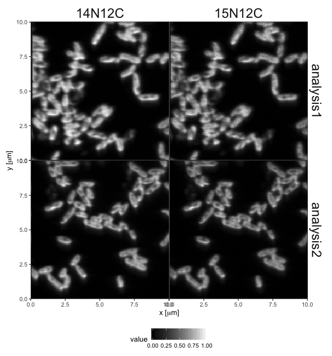

<!-- README.md is generated from README.Rmd. Please edit that file -->

# lans2r

[](https://cran.r-project.org/package=lans2r)
[](https://travis-ci.org/KopfLab/lans2r)
[](https://ci.appveyor.com/project/KopfLab/lans2r)
[](https://codecov.io/github/KopfLab/lans2r?branch=master)
[](https://lans2r.kopflab.org/reference/)

## Overview

The <Look@NanoSIMS> (short LANS) Matlab module written by Lubos
Polerecky (*Polerecky L., Adam B., Milucka J., Musat N., Vagner T. and
Kuypers M. M. M. (2012) <Look@NanoSIMS> - a tool for the analysis of
nanoSIMS data in environmental microbiology. Environmental Microbiology
14, 1009–1023.*) makes it easy to process NanoSIMS data and draw regions
of interest (ROIs). The **lans2r** package provides a convenient
interface to import ion maps and ROI data generated by LANS for
processing and plotting in R/RMarkdown. Additionally, it can process
NanoSIMS tuning (HMR) files.

## Installation

``` r
# Install the latest release of this package from CRAN
install.packages("lans2r") 
# Or the the development version directly from GitHub using devtools:
# install.packages("devtools")
devtools::install_github('KopfLab/lans2r')
```

## Usage

Once installed, load the package with:

``` r
library(lans2r)
```

A concise overview demonstrating the functionality of the **lans2r**
package is provided in the [main
vignette](https://lans2r.kopflab.org/articles/lans2r.html) for the
package, which can also be accessed from within R by calling
`vignette("lans2r")`. Additional vignettes provide details on extended
functionality and can be accessed easily by browsing the package
vignettes from within R calling `browseVignettes("lans2r")`. For details
on individual functions, please consult the package help
(e.g. `?load_LANS_summary`).

## Example

``` r
library(dplyr) # use of %>% and filter
library(lans2r) # the lans2r package

# load two of the data sets supplied with lans2r
load_LANS_maps (
  analysis = c("analysis1", "analysis2"),
  base_dir = system.file("extdata", "nanosims_data", package = "lans2r")
) %>% 
  # focus on the NC ions
  filter(variable %in% c("14N12C", "15N12C")) %>% 
  # plot the ion maps normalized by ion counts for each ion
  plot_maps(normalize = TRUE, draw_ROIs = FALSE)
```


